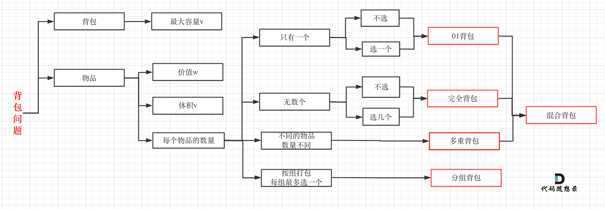

# Codetop Progress
* 跟着 [这里的链接](https://labuladong.gitee.io/algo/di-ling-zh-bfe1b/shuang-zhi-fa4bd/) 刷题，并做拓展训练.
* 刷题语言：主要使用java，少量使用python，未来计划使用rust重写。
* 目前进度: --会员模块都先不写
    1. 核心框架 - 多为基础题目
    - [x] 双指针秒杀7道链表题
    - [x] 双指针秒杀7道数组题
    - [x] 二叉树（纲领篇）
    - [x] 动归基础-零钱问题II卡住
    - [x] 回溯基础
    - [x] BFS解题套路
    - [x] 二分查找
    - [x] 滑动窗口
    - [x] 股票问题
    - [x] 打家劫舍
    - [x] nSum问题
    2. 手把手刷数据结构
    - [x] 链表
    - [x] 数组
        - [x] 前缀和
        - [x] 差分数组
        - [x] 二维数组的花式遍历
        - [x] 常数时间删除/查找数组中的任意元素
    - [x] 二叉树算法
        - [x] 思路
        - [x] 纲领
        - [x] 构造
    - [x] 图
        - [x] 图论基础
        - [x] 二分图
        - [x] 并查集
        - [] 最短路径
        - [] 最小生成树
        - []

* 一些记录
    * 关于背包问题
    
    * 排列,子集，组合问题通常情况下为回溯，暴力+剪枝，少部分情况下为dp问题，比如选子集来满足sum(子集)=target，实际上是01背包。在复杂度较高+不需输出所有情况（仅需统计结果），可以考虑dp。
    * BFS的常见场景：在一幅图中找到起点到终点的最近距离
    * 双向bfs的题目需要再学习下套路
    * 字符串类型的滑动窗口模板中valid变量的使用，来保证时间复杂度。
    * 看到「最大化的最小值」或者「最小化的最大值」就要想到二分法来解题，这是一个固定的套路。
    * 前缀和&&dp的共同之处：只关心前一个状态的值是什么，不关心这个值是怎么计算得来的。
    * 关于前缀&&线段树&&差分
        * 如果只是查询区间和，数组值不修改 -> 前缀和
        * 如何涉及对区间进行更新 -> 线段树（简单的情况下可以使用差分）
            * 关于线段树：https://leetcode.cn/problems/my-calendar-i/solutions/1646079/by-lfool-xvpv/
            * 关于差分，差分能做，线段树都能做，就是差分代码量小。差分要实现开辟数组，有些数组大小高达10**9，这种显然无法差分，只能线段树动态开点。
    * 随机性，O(1)关键词
        * 如果想高效地，等概率地随机获取元素，就要使用数组作为底层容器。
        * 如果要保持数组元素的紧凑性，可以把待删除元素换到最后，然后 pop 掉末尾的元素，这样时间复杂度就是 O(1) 了 -- 紧凑的数组才是好数组
    * 如何判断一个数字是不是2**h-1的值：n&(n+1)==0
    * 二分图：可以理解为上色问题，用于利用节点关系划分两个子集。或者说判断能否划分为两个子集。
    * 图：
        * 判断有无环&&拓扑顺序-> dfs和bfs都行，dfs时注意该条路径上访问过的节点再次访问，即为有环；bfs只要和入度进行关联即可，入度为0时，无前置依赖。
        * 使用场景：以什么顺序做事情，给出事件之间的依赖关系判断能否完成
    * 并查集主要是学会find,union,connected三个函数的板子。

* 暂时放弃的题目
    * 组合总数4
    * 零钱兑换2
    * 划分为k个相等的子集
    * 打家截舍4
    * 反转链表II 写法优化
    * 整数反转 写法优化
    * 我的日程安排I
    * k-连续位的最小翻转次数
    * 螺旋矩阵3,4
    * 黑名单中的随机数-前缀和解法
    * 字典序的第K小数字
    * 迪杰斯特拉章节的几道题
    * 最小生成树的几道题

* 反复练习的题
    * k个一组翻转链表
    * 二叉搜索树的插入和删除
    * 课程表III：练习一遍删去就行

* 开了还没填的坑
    * 线段树,差分数组
    * 多重背包
    * 双向BFS